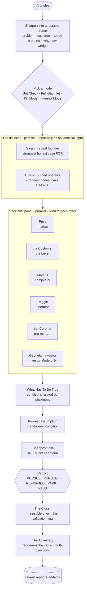

# Idea Validator

A Claude Code skill that pressure-tests a startup, product, or feature idea through an
adversarial panel of named sub-agent personas, distills what has to be true for it to
win, designs the offer that would make the first buyers say yes, and hands you a verdict
you can act on.

Your own enthusiasm is the least reliable signal there is. This skill is the
counterweight. It convenes a room of independent characters who haven't seen each
other's work and can't anchor on your hope, makes them argue, finds the one assumption
your whole idea rests on, and tells you the cheapest way to find out if it's true (and
how to get paid while you do).

It's modeled on the spirit of Garry Tan's gstack `plan-ceo-review` (adversarial,
multi-agent, opinionated, user-sovereign), retargeted from reviewing code plans to
validating ideas.

---

## What it actually does

Run `/validate-idea <your idea>` and the skill:

1. **Sharpens** the idea into a testable frame (problem, customer, today, proposal,
   why-now, wedge).
2. **Picks a mode** with you — Gut Check, Full Gauntlet, Kill Mode, or Investor Mode.
3. **Runs the dialectic** — two personas in parallel: **Sloan** the repeat founder
   builds the strongest honest case *for*; **Dutch** the burned operator builds the
   strongest honest case *against*. Same idea, opposite jobs.
4. **Runs the specialist panel** — more parallel personas, each adversarial in its lane:
   - **Priya** (market) — is the budget real, big enough, why now (web-researched)
   - **the Customer** — the actual buyer, in first person, "I'm busy and I already have a way to do this"
   - **Marcus** (competitor) — the incumbent who copies it in a quarter (web-researched)
   - **Reggie** (operator) — can it be built, distributed, and paid for
   - **the Coroner** (pre-mortem) — the autopsy: how it's dead in 24 months
   - **Gabriela** (investor) — in Investor Mode only
5. **Distills "What Has To Be True"** — turns the believer's case and the skeptic's
   objections into the explicit list of conditions that must *all* hold to win, ranked
   by how shaky each one is. The shakiest is the riskiest assumption.
6. **Finds the cheapest test** — designs the experiment that de-risks the shakiest
   assumption, with kill and success criteria.
7. **Renders a verdict** — PURSUE / PURSUE-REFRAMED / PARK / PASS, scored against a
   rubric where one fatal flaw caps the whole thing (an idea is not an average).
8. **Designs the offer** — **The Closer** builds an irresistible offer and a
   cash-flow-smart price (deposit-for-credit, founding pricing, guarantees) where the
   paid pre-sale *is* the validation test. Money beats words.
9. **Red-teams its own verdict** — **The Adversary** challenges the conclusion in both
   directions (too kind? too harsh?), and the verdict gets revised or defended in the open.
10. **Writes a linked report** — a directory of files (executive-summary index → dialectic,
    what-has-to-be-true, panel, the test, the offer, red team) plus ready-to-use
    artifacts: a landing-page prompt, an interview script, and cold outreach.

Everything important is decided *with* you, not for you.



---

## Install

```bash
./install.sh          # symlinks the skill into ~/.claude/skills/validate-idea
```

Then `/validate-idea` works in any session. Uninstall: `rm ~/.claude/skills/validate-idea`.

Reports land in `idea-validations/<date>-<slug>/` in your current working directory, so you
can watch the files appear live as the panel runs.

---

## Usage

```
/validate-idea an AI chief-of-staff for solo founders that reads my email,
calendar, and Slack and proactively runs my day
```

or conversationally: *"I'm thinking about building X. Pressure-test it before I commit."*

Modes you can ask for directly:
- "just gut-check this" → **Gut Check** (fast)
- "tear it apart" / "I'm already in love with this" → **Kill Mode**
- "I'm pitching VCs" → **Investor Mode**
- otherwise → **Full Gauntlet** (default)

Swap personas on the fly: *"be my toughest customer Dana"* or *"review it like Bezos."*

---

## A worked example (real results)

[`skills/validate-idea/examples/2026-06-27-ai-chief-of-staff-solo-founders/`](skills/validate-idea/examples/2026-06-27-ai-chief-of-staff-solo-founders/)
is a real run of the full gauntlet — produced by the panel with live web research, not
hand-written. Start with [`index.md`](skills/validate-idea/examples/2026-06-27-ai-chief-of-staff-solo-founders/index.md)
(the 60-second executive summary) and follow its links. Verdict came out PURSUE-REFRAMED
at low confidence (effectively a PASS as framed), with a $500 concierge pre-sale designed
as the validation test. It's the honest output, fatal flaws and all.

---

## Repo layout

```
idea-validator/
├── README.md
├── install.sh
└── skills/validate-idea/
    ├── SKILL.md                 # the skill — read as instructions
    ├── references/
    │   ├── panel.md             # the named personas + return contracts
    │   ├── rubric.md            # scoring + capping rules + verdicts
    │   ├── offer-playbook.md    # business/offer knowledge (the value equation, cash-flow plays)
    │   └── report-format.md     # the linked multi-file output spec
    └── examples/
        └── 2026-06-27-ai-chief-of-staff-solo-founders/   # a real produced run
```

---

## Design notes

- **The contrast is structural, not stylistic.** Sloan and Dutch get opposite jobs on
  identical input. The five lenses are blind to each other. The Adversary is blind to the
  panel. Independence is the whole value — that's why it's real sub-agents, not one model
  wearing six hats.
- **"What has to be true" is the bridge.** Believers and skeptics aren't the output; the
  conditions they imply are. The least-certain condition is the bet you have to test.
- **A fatal flaw caps the score.** Averaging is how bad ideas get a passing grade. One
  market-of-nobody or zero-moat finding overrides a high total.
- **Money is the real test.** The offer isn't a side quest. A paid deposit from the exact
  buyer is the strongest validation signal there is, so the offer is designed to *be* the
  experiment, with a kill number.
- **User sovereignty.** The skill never silently defaults a decision you should own. It
  recommends hard and defers to you.
